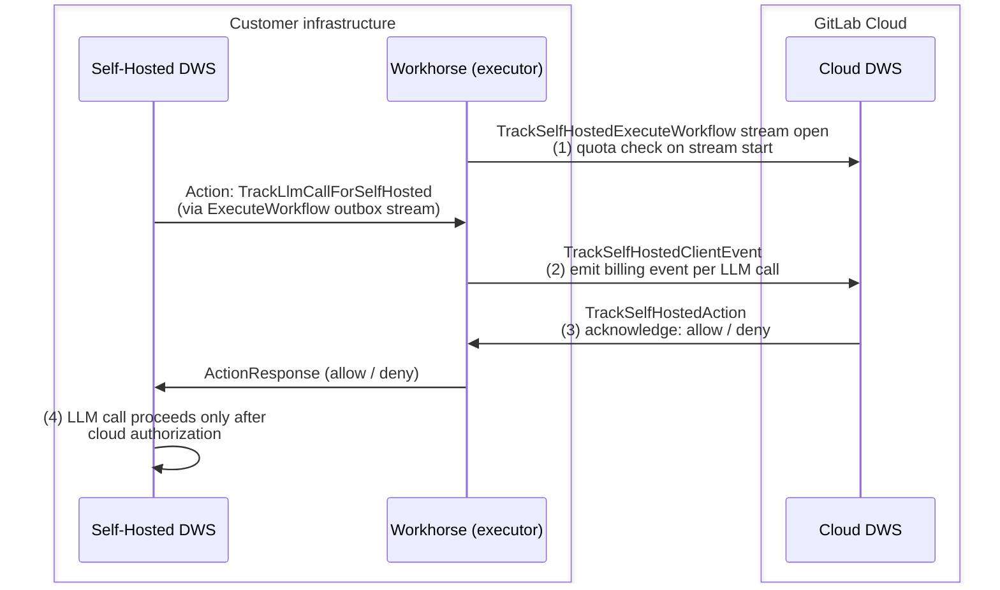

# Self-Hosted DAP Usage Billing

This document describes the billing architecture for **Duo Self-Hosted DAP** deployments running
on **cloud (online) licensing**. It covers how per-LLM-call usage is tracked, authorized, and
reported to CustomersDot without the LLM traffic ever leaving the customer's infrastructure.

For the standard Cloud AI Gateway billing flow (SaaS and self-managed), see the [Technical Overview](billable_usage_technical_overview.md).

## Background

Self-hosted Duo deployments run both the AI Gateway and the Duo Workflow Service (DWS) on
customer infrastructure. The LLM calls are made directly from the self-hosted DWS to the
customer's own model provider — Cloud AI Gateway never sees the prompt or response content.

For **online (cloud) licensing**, the pricing model is per-LLM-call usage charged at a
flat-rate using GitLab credits. Because the Cloud AI Gateway cannot observe the LLM
calls directly, a dedicated billing bridge is required.

## When self-hosted billing is active

From the perspective of the DWS, self-hosted per-request billing is active when:

- The DWS service is running in self-hosted mode (`AIGW_CUSTOM_MODELS__ENABLED=true`).
- The `x-gitlab-self-hosted-dap-billing-enabled: true` header is present on the incoming
  gRPC request.

Rails/Workhorse is responsible for setting that header. The exact criteria evaluated
there (license type, model configuration, and so on) are implemented in the Rails codebase
and are outside the scope of this document.

## Architecture overview

The billing bridge uses a **bidirectional gRPC stream** between the self-hosted DWS and the
Cloud DWS, mediated by Workhorse. The LLM call itself remains entirely within the customer's
infrastructure; only lightweight billing metadata is sent to the cloud.



## Step-by-step flow

### 1. Workhorse opens the billing stream — quota check on stream start

When a workflow starts, Rails provides Workhorse with the Cloud DWS endpoint and
authentication headers. Workhorse opens a long-lived bidirectional gRPC stream to Cloud DWS,
held for the lifetime of the workflow. Cloud DWS performs an upfront quota check against
CustomersDot before accepting the stream. If the consumer has no credits, the stream is
rejected immediately and no LLM calls can proceed.

### 2. Self-hosted DWS signals each LLM call — emit billing event per LLM call

Before each LLM call, the self-hosted DWS sends a lightweight billing signal to Workhorse
over the existing workflow stream. The signal carries the workflow ID and the feature being
invoked. Workhorse forwards it to Cloud DWS, which records a billing event. Because the LLM
runs on customer infrastructure, Cloud DWS uses standardized placeholder values instead of
real token counts.

### 3. Cloud DWS acknowledges — allow or deny

Cloud DWS responds to Workhorse with an acknowledgment. Workhorse passes it back to the
self-hosted DWS.

### 4. LLM call proceeds only after cloud authorization

- If Cloud DWS returned success, the LLM call proceeds against the customer's own model
  provider.
- If Cloud DWS returned failure (quota exceeded, invalid license, and so on), the LLM call
  is aborted.

## Key components

### Context variable: `self_hosted_dap_billing_enabled`

**Location**: Self-Hosted DWS — `lib/events/contextvar.py`

A `ContextVar[bool]` that signals whether self-hosted billing is active for the current
request. It defaults to `False` and is set per-request by the `MetadataContextInterceptor`
in the self-hosted DWS when `AIGW_CUSTOM_MODELS__ENABLED=true` and the
`x-gitlab-self-hosted-dap-billing-enabled` header is present and truthy.

### Prompt registry wrapper: `PromptRegistrySelfHostedBillingSupport`

**Location**: Self-Hosted DWS — `duo_workflow_service/interceptors/route/usage_billing.py`

When `self_hosted_dap_billing_enabled` is `True`, the `support_self_hosted_billing`
decorator wraps the workflow's prompt registry with
`PromptRegistrySelfHostedBillingSupport`. This wrapper intercepts every call to
`registry.get(...)` and appends a `SelfHostedBillingPromptCallbackHandler` to the
returned prompt's `internal_callbacks` list.

The callback's `on_before_llm_call` hook fires before each LLM invocation and sends the
`TrackLlmCallForSelfHosted` action to Workhorse via the workflow outbox, then waits for
Workhorse to return an `ActionResponse`.

```python
# duo_workflow_service/interceptors/route/usage_billing.py
class SelfHostedBillingPromptCallbackHandler(BasePromptCallbackHandler):
    async def on_before_llm_call(self):
        action = contract_pb2.Action(
            trackLlmCallForSelfHosted=contract_pb2.TrackLlmCallForSelfHosted(
                workflowID=self.workflow_id,
                featureQualifiedName=self.gl_reporting_event_context.feature_qualified_name,
                featureAiCatalogItem=self.gl_reporting_event_context.feature_ai_catalog_item or False,
            )
        )
        await self.outbox.put_action_and_wait_for_response(action)
```

The `support_self_hosted_billing` decorator is applied to all workflow and flow entry
points:

```python
# Example: duo_workflow_service/workflows/software_development/workflow.py
@support_self_hosted_billing(class_schema="legacy")
class SoftwareDevelopmentWorkflow(AbstractWorkflow):
    ...

# Example: duo_workflow_service/agent_platform/v1/flows/base.py
@support_self_hosted_billing(class_schema="flow/v1")
class BaseFlow:
    ...
```

### Billing event emission: `SelfHostedLLMOperations`

**Location**: Cloud DWS — `lib/billing_events/service.py`

A billing event is emitted on the Cloud DWS before the LLM call is allowed to proceed,
with `unit_of_measure="request"` and a quantity of `1` per LLM call.
`SelfHostedLLMOperations` provides standardized placeholder values for model metadata,
since the actual model runs on customer infrastructure and its token counts are not available
to Cloud DWS. The placeholder operations are passed explicitly to
`BillingEventService.track_billing` via the `llm_ops` parameter at the call site.

## Usage quota check

Usage quota is enforced on the Cloud DWS when the billing stream is opened. It uses the
same quota check mechanism as SaaS and self-managed deployments — if the consumer has no
credits, the stream is rejected before any LLM calls can proceed.

## Test locally

> Work in progress. This section will be updated.

## Further reading

- [Epic: Original design and high-level proposal (internal only)](https://gitlab.com/groups/gitlab-org/-/work_items/20495)
