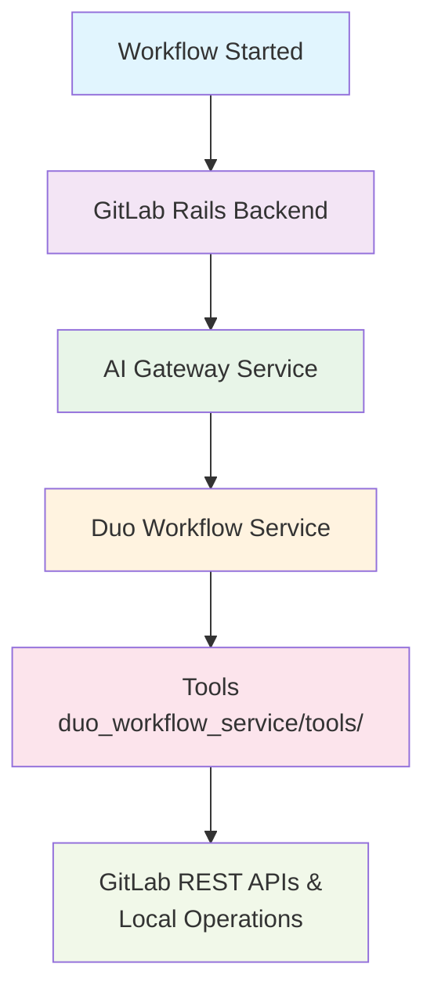

# Duo Workflow Service Tools

> **Note**: This documentation was generated with AI assistance to provide comprehensive coverage of the tools architecture and usage patterns.

This directory contains the LangGraph-compatible tools that power GitLab AI features. These tools enable AI agents to interact with GitLab resources and perform complex workflows as part of GitLab backend infrastructure.

## Architecture Overview

### Backend Service Architecture

These tools are **backend services** that power GitLab AI features. They operate as part of GitLab infrastructure and can be triggered from various entry points (web interface, IDE extensions, Remote Execution):



### User Interaction Flow

When users interact with GitLab AI features, the agents decide whether to execute tools.

#### **GitLab Duo Chat Example:**

```plaintext
User: "Are there security issues in my latest MR?"

Backend Workflow:
1. get_merge_request → Fetches MR details via /api/v4/projects/{id}/merge_requests/{iid}
2. list_merge_request_diffs → Gets changed files via /api/v4/projects/{id}/merge_requests/{iid}/diffs
3. get_repository_file → Analyzes each changed file via /api/v4/projects/{id}/repository/files/{path}
4. create_merge_request_note → Adds review comments via /api/v4/projects/{id}/merge_requests/{iid}/notes

Result: User sees AI analysis and comments in GitLab web interface
```

#### **Automated Code Review Example:**

```plaintext
User: Creates a merge request in GitLab web interface

Automatic Backend Workflow:
1. list_merge_request_diffs → Analyzes what changed
2. get_repository_file → Reviews modified files
3. create_merge_request_note → Adds AI review comments
4. update_merge_request → Updates labels (e.g., "ai-reviewed")

Result: Review comments and labels appear automatically in the MR
```

### Real GitLab API Integration

Each tool makes direct calls to GitLab REST API endpoints:

```python
# Example from merge_request.py
async def _arun(self, **kwargs) -> str:
    # Direct API call to GitLab backend
    response = await self.gitlab_client.aget(
        path=f"/api/v4/projects/{project_id}/merge_requests/{iid}",
        parse_json=False,
    )
    return json.dumps({"merge_request": response})
```

## Core Components

```plaintext
duo_workflow_service/tools/
├── duo_base_tool.py          # Base class for all tools
├── toolset.py               # Tool collection management
├── gitlab_resource_input.py  # Common input schemas
├── search.py                # GitLab search capabilities
├── search_system.py         # Advanced search system
├── repository_files.py      # File operations
├── issue.py                 # Issue management
├── merge_request.py         # Merge request operations
├── pipeline.py              # CI/CD pipeline tools
├── job.py                   # CI/CD job operations
├── commit.py                # Git commit operations
├── git.py                   # Git operations
├── filesystem.py            # File system operations
├── command.py               # Command execution
├── epic.py                  # Epic management
├── project.py               # Project data retrieval
├── planner.py               # Workflow planning
├── handover.py              # Agent handover
├── previous_context.py      # Workflow history access
└── request_user_clarification.py  # User interaction
```

### Tool Architecture Pattern

All tools follow a consistent architecture pattern:

```python
class ExampleTool(DuoBaseTool):
    name: str = "tool_name"                    # Unique tool identifier
    description: str = "Tool description"      # LLM-readable description
    args_schema: Type[BaseModel] = InputModel  # Pydantic input validation

    async def _arun(self, **kwargs) -> str:    # Async execution method
        # Tool implementation
        pass

    def format_display_message(self, args) -> str:  # User-friendly messages
        # Format execution feedback
        pass
```

## Key Advantages

### 1. **LangGraph Integration**

- **Native Compatibility**: Built specifically for LangGraph workflows
- **Agent Orchestration**: Tools can be chained and combined intelligently
- **State Management**: Maintains context across multi-step operations
- **Error Recovery**: Graceful handling of failures with retry mechanisms

### 2. **GitLab-Native Operations**

- **Deep Integration**: Direct access to GitLab APIs with proper authentication
- **Permission Awareness**: Respects GitLab role-based access control
- **Resource Validation**: Built-in URL parsing and resource validation
- **Consistent Error Handling**: Standardized error responses across all tools

### 3. **Extensible Design**

- **Plugin Architecture**: Easy addition of new tools without core changes
- **Composable Operations**: Tools can be combined for complex workflows
- **Configurable Behavior**: Tools adapt to different project/group contexts
- **Type Safety**: Full Pydantic validation for all inputs and outputs

### 4. **Developer Experience**

- **Rich Documentation**: Comprehensive descriptions for LLM understanding
- **Display Messages**: Human-readable execution feedback
- **Error Context**: Detailed error messages with actionable information
- **Debugging Support**: Structured logging and monitoring integration

## Tool Categories

### Search and Discovery

- **`gitlab_*_search`**: Search across issues, MRs, commits, files, users
- **`search_system`**: Advanced search capabilities
- **`previous_context`**: Access to workflow history

### Code and Repository Management

- **`get_repository_file`**: Retrieve file contents
- **`filesystem`**: File system operations
- **`git`**: Git operations
- **`commit`**: Commit analysis and operations

### Project Management

- **`issue`**: Issue creation, updates, and management
- **`merge_request`**: MR operations and reviews
- **`epic`**: Epic management for larger initiatives
- **`pipeline`**: CI/CD pipeline operations
- **`job`**: CI/CD job operations

### Workflow Orchestration

- **`planner`**: Workflow planning and task breakdown
- **`handover`**: Agent-to-agent communication
- **`request_user_clarification`**: Interactive user input

## Development

### Setup Development Environment

```shell
# Setup development environment
poetry install --with test

# Run all tool tests
poetry run pytest tests/duo_workflow_service/tools/ -v

# Run specific tool tests
poetry run pytest tests/duo_workflow_service/tools/test_repository_files.py -v
```

### Adding New Tools

#### 1. Basic Tool Implementation

```python
from typing import Type
from pydantic import BaseModel, Field
from duo_workflow_service.tools.duo_base_tool import DuoBaseTool

class MyToolInput(BaseModel):
    project_id: str = Field(description="The GitLab project ID")
    parameter: str = Field(description="Tool-specific parameter")

class MyTool(DuoBaseTool):
    name: str = "my_custom_tool"
    description: str = """
    Description of what this tool does.

    Parameters:
    - project_id: The GitLab project ID (required)
    - parameter: Tool-specific parameter (required)

    Example usage:
    {
        'name': 'my_custom_tool',
        'input': {
            'project_id': '123',
            'parameter': 'value'
        }
    }
    """
    args_schema: Type[BaseModel] = MyToolInput

    async def _arun(self, project_id: str, parameter: str) -> str:
        try:
            # Tool implementation
            result = await self.gitlab_client.aget(
                path=f"/api/v4/projects/{project_id}/custom_endpoint",
                params={"param": parameter}
            )
            return json.dumps({"result": result})
        except Exception as e:
            return json.dumps({"error": str(e)})

    def format_display_message(self, args: MyToolInput) -> str:
        return f"Executing custom operation on project {args.project_id}"
```

#### 2. Register the Tool

Add your tool to `__init__.py`:

```python
# duo_workflow_service/tools/__init__.py
from .my_tool import *
```

#### 3. Tool Best Practices

##### Input Validation

```python
class ToolInput(BaseModel):
    # Use descriptive field descriptions for LLM understanding
    project_id: str = Field(description="The GitLab project ID")

    # Provide defaults where appropriate
    ref: Optional[str] = Field(default="HEAD", description="Git reference")

    # Use enums for limited choices
    action: Literal["create", "update", "delete"] = Field(description="Action to perform")

    # Validate complex inputs
    @validator('project_id')
    def validate_project_id(cls, v):
        if not v.isdigit():
            raise ValueError('project_id must be numeric')
        return v
```

##### Error Handling

```python
async def _arun(self, **kwargs) -> str:
    try:
        # Validate inputs using base class methods
        project_id, errors = self._validate_project_url(
            kwargs.get('url'),
            kwargs.get('project_id')
        )

        if errors:
            return json.dumps({"error": "; ".join(errors)})

        # Perform operation
        result = await self.gitlab_client.aget(path=f"/api/v4/projects/{project_id}")

        return json.dumps({"success": True, "data": result})

    except Exception as e:
        return json.dumps({"error": str(e), "tool": self.name})
```

##### Display Messages

```python
def format_display_message(self, args: ToolInput) -> str:
    # Provide context-aware, human-readable messages
    if hasattr(args, 'url') and args.url:
        return f"Processing {self.name} for {args.url}"
    else:
        return f"Executing {self.name} on project {args.project_id}"
```

## Testing Tools

The tools ecosystem uses a comprehensive testing strategy with multiple layers to ensure reliability and maintainability. The framework demonstrates robust coverage across all tool categories.

### Testing Architecture

```plaintext
tests/duo_workflow_service/tools/
├── test_duo_base_tool.py        # Base class functionality
├── test_toolset.py              # Tool collection management
├── test_search.py               # Search tools (parametrized tests)
├── test_search_system.py        # Advanced search system
├── test_repository_files.py     # File operations
├── test_issue.py                # Issue management
├── test_merge_request.py        # MR operations
├── test_pipeline.py             # CI/CD pipeline tools
├── test_job.py                  # CI/CD job operations
├── test_commit.py               # Git operations
├── test_git.py                  # Git operations
├── test_filesystem.py           # File system operations
├── test_run_command.py          # Command execution
├── test_epic.py                 # Epic management
├── test_project.py              # Project data retrieval
├── test_planner.py              # Workflow planning
├── test_previous_context.py     # Workflow history access
└── test_action.py               # Action handling
```

### Running Tests

**Basic Test Execution:**

```shell
# Run all tool tests
poetry run pytest tests/duo_workflow_service/tools/ -v

# Run specific tool tests
poetry run pytest tests/duo_workflow_service/tools/test_repository_files.py -v

# Run with coverage reporting
poetry run pytest tests/duo_workflow_service/tools/ --cov=duo_workflow_service.tools --cov-report=term-missing
```

**Test Categories:**

```shell
# Run security-related tests
poetry run pytest -k "security" -v

# Run performance tests
poetry run pytest -k "performance" -v

# Run error handling tests
poetry run pytest -k "error" -v
```

### Unit Testing

#### Basic Tool Testing Pattern

```python
import pytest
from unittest.mock import AsyncMock
from duo_workflow_service.tools.my_tool import MyTool, MyToolInput

@pytest.fixture
def gitlab_client_mock():
    return AsyncMock()

@pytest.fixture
def metadata(gitlab_client_mock):
    return {
        "gitlab_client": gitlab_client_mock,
        "gitlab_host": "gitlab.com",
    }

@pytest.fixture
def tool(metadata):
    return MyTool(metadata=metadata)

@pytest.mark.asyncio
async def test_my_tool_success(tool, gitlab_client_mock):
    # Arrange
    gitlab_client_mock.aget.return_value = {"result": "success"}

    # Act
    result = await tool._arun(project_id="123", parameter="test")

    # Assert
    assert "success" in result
    gitlab_client_mock.aget.assert_called_once_with(
        path="/api/v4/projects/123/custom_endpoint",
        params={"param": "test"}
    )

@pytest.mark.asyncio
async def test_my_tool_error_handling(tool, gitlab_client_mock):
    # Arrange
    gitlab_client_mock.aget.side_effect = Exception("API error")

    # Act
    result = await tool._arun(project_id="123", parameter="test")

    # Assert
    error_response = json.loads(result)
    assert "error" in error_response
    assert "API error" in error_response["error"]

def test_format_display_message(tool):
    args = MyToolInput(project_id="123", parameter="test")
    message = tool.format_display_message(args)
    assert message == "Executing custom operation on project 123"
```

## Contributing

When adding new tools:

1. **Follow the established patterns** in existing tools
1. **Write comprehensive descriptions** for LLM understanding
1. **Include proper error handling** and validation
1. **Add unit and integration tests**
1. **Update this README** with new tool categories and file lists
1. **Consider security implications** of new capabilities
